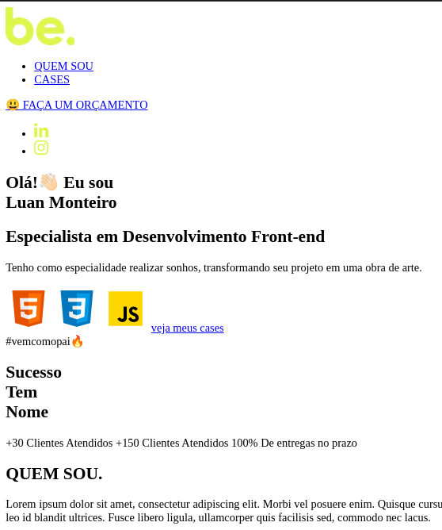
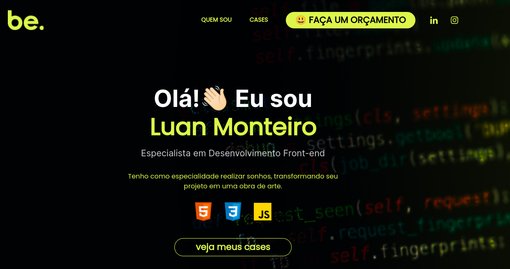
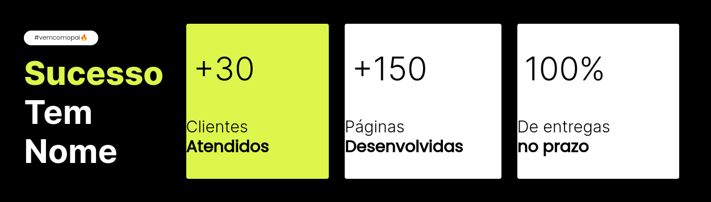

# Título do Projeto

Este projeto foi desenvolvido no bootcamp DevStart PayLivre sobre supervisão da be.academy.<br/>
Neste repositório está descrito o processo de criação da réplica do modelo disponibilizado para todos os alunos.

## 🚀 Sobre mim
Eu sou uma pessoa desenvolvedora full-stack, sempre disposto a encarar novos desafios na area da programação.

## Stack utilizada

**Front-end:** HTML, CSS e Javascript

## 📁 Estrutura do projeto

- assets
  - images
  - script
  - styles
    - pattern.css
    - reset.css
    - responsive.css
    - style.css
- index.html

## ⚒️ Primeira Etapa:

- [x] Trabalhando o HTML
    <details>
        <summary>TEXTO DO SITE</summary>
        <br>

        be.

        QUEM SOU
        CASES
        😃 FAÇA UM ORÇAMENTO

        Olá!👋🏻 Eu sou  
        Luan Monteiro
        Especialista em Desenvolvimento Front-end

        Tenho como especialidade realizar sonhos, transformando seu projeto em uma obra de arte.

        veja meus cases

        #vemcomopai🔥

        Sucesso
        Tem
        Nome

        QUEM SOU.

        Lorem ipsum dolor sit amet, consectetur adipiscing elit. Morbi vel posuere enim. 
        Quisque cursus ac leo et maximus. Proin non diam congue, sodales velit et, cursus ante. 
        Suspendisse convallis rhoncus dapibus. Vivamus accumsan leo id blandit ultrices. 
        Fusce libero ligula, ullamcorper quis facilisis sed, commodo nec lacus. 

        CASES.

        ENTRE EM CONTATO.
        #LetsGoUp🚀

        Feito com ❤️ e carinho por mim.

    </details>

    - Criar a estrutura no Index.html
        ``` index.html

            <!DOCTYPE html>
            <html lang="pt-br">
            <head>
                <meta charset="UTF-8">
                <meta http-equiv="X-UA-Compatible" content="IE=edge">
                <meta name="viewport" content="width=device-width, initial-scale=1.0">
                <title>MyPortfólio</title>
            </head>
            <body>
                TEXTO DO SITE
            </body>
            </html>
        ```

- [x] Definir as marcações semânticas do porjeto
  - Cabeçalho 
    ```
    <header>
        <!--logo-->
        <!--botões de navegação-->
    </header>

    ```
  - Barra de Navegação
    ```
    <nav>
        <!--lista de links-->
    </nav>

    ```
  - Conteúdo principal
    ```
    <main>
        <!--suas seções-->
    </main>

    ```
    - Suas subseções de conteúdo
        ```
        <section>
            <!--conteúdos da seção-->
        </section>

        ```
  - Rodapé
    ```
    <footer>
        <!--informações-->
    </footer>

    ```

## 🧰 Segunda Etapa:

- [x] Criar container que envolvera as partes importantes do projeto 

- [x] Trabalhando o CSS/style
    - Olhamos para o layout do site e procurando por estilos que se repetem e colocamos em um unico arquivo.
        - Pattern
          - Fonte
          - Cores
          - Componentes
- [X] Customizar HEADER
- [x] Customizar a MAIN
  - Estilo da section "s-hero"
  - Estilo da section "s-access"
  - Estilo da section "s-about"
  - Estilo da section "s-contact"
- [] Customizar footer


## Lista releases

Netes cáptulo, deixo os momentos de cada sprites do desenvolvimento, fique a vontade casso queira parti de algum momento sua criação.

- [release-init-html](https://github.com/neresfabio/beacademy-devstart-frontend-myportfolio/tree/release-init-html)

    

- [release-style-header-section(s-hero)](https://github.com/neresfabio/beacademy-devstart-frontend-myportfolio/tree/release-style-header-section)
  
  

- [release-style-section(s-access)](https://github.com/neresfabio/beacademy-devstart-frontend-myportfolio/blob/release-style-section-s-access/README.md)
  
  

- [release-style-section(s-about)]()
  
  

- [release-style-section(s-contact)]()
  
  

## Aprendizados


## Autores

- [@neresfabio](https://github.com/neresfabio)


## 🔗 Links
[]()
[](https://www.linkedin.com/in/fabioneresdejesus/)

## Referências

- Introdução a web - developer.mozilla: [Qual estrutura seu site deve ter?](https://developer.mozilla.org/pt-BR/docs/Learn/Getting_started_with_the_web/Dealing_with_files)

- Introdução ao HTML - developer.mozilla: [Estrutura de documento e sites](https://developer.mozilla.org/pt-BR/docs/Learn/HTML/Introduction_to_HTML/Document_and_website_structure)
  
- Estrutura de documento e sites - developer.mozilla: [HTML para estruturar conteúdo](https://developer.mozilla.org/pt-BR/docs/Learn/HTML/Introduction_to_HTML/Document_and_website_structure)
